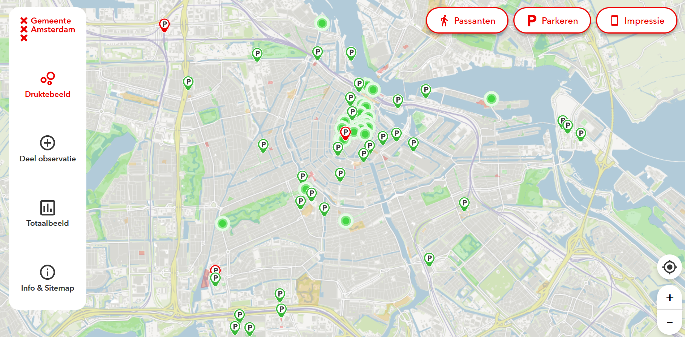
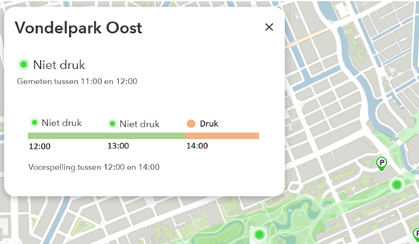
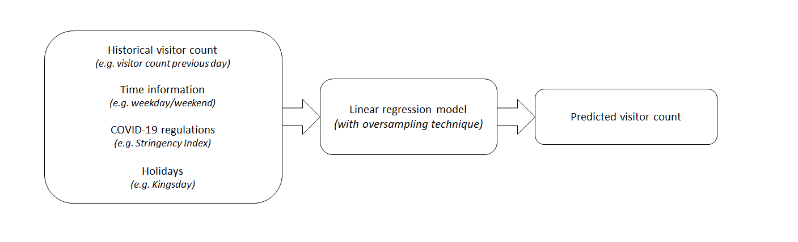

# Short-term Crowdedness Predictions for Public Locations in Amsterdam

This repository shows the code that I produced for my thesis project on predicting crowdedness at the City of Amsterdam.
The City of Amsterdam has developed a crowd monitoring website (https://druktebeeld.amsterdam.nl/) which is publicly accessible. Here, citizens and visitors can receive information on real-time crowdedness in Amsterdam based on various data sources (sensors, parking garages, etc.).


*Screenshot of the druktebeeld website.*

For my thesis project in Artificial Intelligence I created code to make 2 hour-ahead predictions for the crowdedness levels at various public locations in Amsterdam, that can be shown on the druktebeeld website. These locations are mostly parks and squares, but can also be shopping streets or market places. 



*A concept of the crowdedness predictions in druktebeeld.*

The data source that is being predicted are aggregated visitor counts per location, gathered by Resono (https://reso.no/). After performing multiple experiments, the selected prediction model is a linear regression model with the addition of an oversampling technique (SMOTE). For each public location, the model takes past crowdedness observations, time information, COVID-19-related information and holiday information as input and outputs the predicted number of visitors for the next 2 hours. 


*Diagram of the selected prediction model.*

---


## Project Folder Structure

1) [`code`](./code): Folder containing a public version of the project code. This means that some information is deleted from the code (for example information on the database connection).
2) [`figures`](./figures): Folder containing figures used to illustrate the project.

---


## How it works

In the main notebook, ```crowdedness_predictions.ipynb``` predictions can be generated based on some settings. These settings can be given as arguments in the notebook (more explanations on the different arguments are given in the notebook). This notebook makes use of four files with functions ```main.py```, ```preprocessing.py```, ```modelling.py``` and ```backtesting.py```. 

With the notebook the predictions can be generated using the following steps:
1) Reading in the data from the database (crowdedenss data and external factors)
2) Preprocessing the data 
3) Training a prediction model
4) Generating the predictions 
5) Outputting the predictions to the database

**Backtesting**: Several experiments were performed where the use of different predictor variables and prediction models were compared based on validation/test data.  This was done in the backtesting section of the notebook. 

---
## Acknowledgements

- Public data source: Government Response Stringency Index: https://covidtracker.bsg.ox.ac.uk/about-api
- Private data source: Location data based on mobile devices: https://reso.no/
- Some functions in ```preprocessing.py``` and ```backtesting.py``` were written by Shayla Jansen (@City of Amsterdam). 


